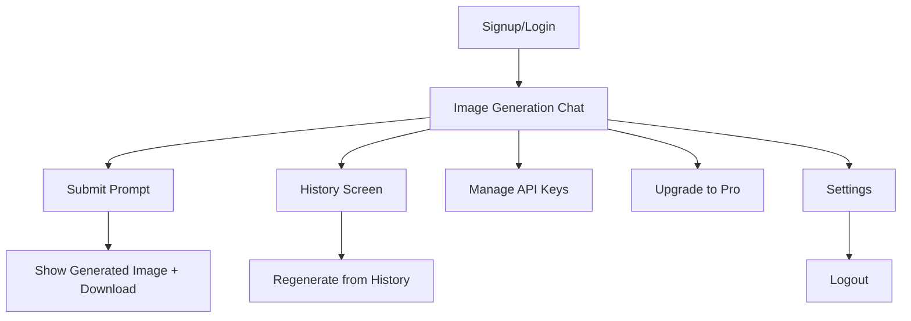

# **PRD - Éclair AI**  

---

### **1. Introduction**  
**Product Description**:  
Éclair AI est une **webapp de génération d'images basée sur des prompts**, permettant aux utilisateurs de coller leurs propres clés API (BYOK) pour utiliser des modèles comme DALL·E, Stable Diffusion, Google Imagen, Hugging Face, et OpenRouter.  

**Core Value Proposition**:  
- **Flexibilité** : Choisissez votre fournisseur d'API préféré.  
- **Sécurité** : Clés API chiffrées et protégées via un proxy.  
- **Freemium** : 30 générations gratuites/mois, abonnement premium pour HD et illimité.  

**MVP Focus (Problem-Solution Fit)**:  
- **Problème** : Les utilisateurs ont du mal à gérer plusieurs clés API de manière sécurisée et flexible.  
- **Solution** : Interface simple pour coller ses clés, générer des images, et accéder à un historique.  

---

### **2. Objectives and Goals**  

#### **Primary Objectives**  
- **User Problems Solved**:  
  - Gestion centralisée des clés API multi-providers.  
  - Génération d'images sans dépendance à une plateforme unique.  
  - Sécurité maximale des clés API (chiffrement AES-256 + proxy).  
- **Technical Outcomes**:  
  - MVP léger, déployable en 4-6 semaines.  
  - Scalable pour ajouter des fonctionnalités (prompt optimizer, marketplace).  

#### **Business Goals**  
- **Revenue**:  
  - Abonnement premium à 5€/mois ou 50€/an (20% de réduction annuelle).  
  - Partenariats avec des providers pour vendre des crédits via une marketplace (phase 2).  
- **Market Positioning**:  
  - Cibler les créateurs, designers, et développeurs exigeants en flexibilité et sécurité.  
  - Se différencier des solutions centralisées (ex : Midjourney, DALL·E) par le BYOK.  
- **Engagement**:  
  - Historique des générations pour retrouver ses créations.  
  - Monétisation progressive : freemium → premium → marketplace.  

---

### **3. Target Users and Roles**  

#### **Target User Segments**  
- **Individual Creators**:  
  - Illustrateurs, designers, graphistes cherchant des outils flexibles.  
- **Developers & Tech-Savvy Users**:  
  - Utilisent des clés API multiples et valorisent la sécurité.  
- **Small Businesses**:  
  - Besoin de génération d'images sans dépendance à une plateforme unique.  

#### **User Roles**  
- **Standard User (Free/Premium)**:  
  - Coller des clés API.  
  - Générer des images avec paramètres (résolution, style).  
  - Accéder à l'historique.  
  - Upgrader vers Pro (illimité, HD).  
- **Admin (Phase 2 - Enterprise)**:  
  - Gérer des équipes et des crédits partagés.  
  - Accès à des templates professionnels.  

---

### **4. Key Features and Functionality**  

#### **MVP Must-Have Features**  
##### **a) Gestion des Clés API (BYOK)**  
- Interface utilisateur pour coller des clés API.  
- Liste déroulante des providers supportés (OpenAI, Stability AI, Hugging Face, OpenRouter).  
- Validation automatique des clés (ex : "Clé OpenAI valide ✅").  
- **Sécurité** : Chiffrement AES-256 + proxy API côté serveur.  

##### **b) Interface de Génération d'Images**  
- Champ de texte pour le prompt (ex : "Un chat cyberpunk sur une moto flottante").  
- Bouton "Générer" (désactivé sans clé valide).  
- Paramètres optionnels : résolution (1024x1024 / HD), style (photo / artistique).  
- Résultats : Thumbnail grid + téléchargement (PNG/JPG).  

##### **c) Historique des Générations**  
- Liste paginée des images générées avec :  
  - Aperçu miniature.  
  - Prompt utilisé.  
  - Provider (ex : "Généré avec Stability AI").  
  - Date et heure.  
- Actions : "Regénérer" (copie le prompt dans le chat), "Télécharger", "Supprimer".  

##### **d) Authentification**  
- Connexion/inscription par email/mot de passe ou Google/GitHub.  
- Espace utilisateur pour gérer les clés API et l'historique.  

##### **e) Monétisation (Stripe)**  
- **Free Plan** : 30 générations/mois, résolution standard, 2 providers.  
- **Pro Plan** : Illimité, HD (4K/SVG), tous les providers.  
- Stripe Checkout pour les abonnements (mensuel/anuel).  

#### **UX Notes**  
- **Mobile Responsiveness**:  
  - Chat input collapse en floating action button sur mobile.  
- **Feedback Événements**:  
  - Loader pendant la génération ("Generating image… (ETA: 15s)").  
  - Toast success ("Image téléchargée ✅").  
  - Modals d'erreur ("Clé API invalide").  
- **Prompt Editing**:  
  - Modification d’un prompt historisé crée une **nouvelle génération** sans altérer l’original.  

---

### **5. User Journey**  

#### **Step-by-Step Flow**  
1. **Signup/Login** → Email/mot de passe ou Google/GitHub.  
2. **Ajout de Clés API** → Via le menu utilisateur → "Manage Keys".  
3. **Génération d'Image** →  
   - Coller un prompt → sélectionner un provider → cliquer sur "Generate".  
   - Loader → image affichée avec bouton "Download".  
4. **Accès à l’Historique** → Navigation par chat (ex : "Cyberpunk Cat", "Futuristic City").  
5. **Upgrader vers Pro** → Comparaison Free vs Pro + Stripe Checkout.  
6. **Logout** → Déconnexion sécurisée.  

#### **Diagramme de Flux**  

---

### **6. Tech Stack and Third-Party Integrations**  

| **Category**             | **Tools**                                                       |
| ------------------------ | --------------------------------------------------------------- |
| **Frontend**             | Next.js + Tailwind CSS + ShadCN UI (design system)              |
| **Backend**              | Supabase Auth + PostgreSQL + Functions (proxy API + encryption) |
| **AI APIs**              | OpenAI, Stability AI, Google Imagen, Hugging Face, OpenRouter   |
| **Monétisation**         | Stripe Billing (abonnements récurrents)                         |
| **Sécurité**             | AES-256 (crypto-js) + Content-Security-Policy                   |
| **Déploiement**          | Vercel + Supabase CLI                                           |
| **Monitoring (Phase 2)** | Sentry (erreurs) + Plausible (analytics)                        |

---

### **7. Future Scope (Out of MVP)**  

#### **Phase 2 Features**  
- **Prompt Optimizer** : Amélioration des prompts via un LLM (ex : ajout de "style réaliste").  
- **Templates Prédéfinis** : Logo, illustrations, UI design.  
- **Export HD** : SVG, 4K, PNG.  
- **Suivi des Coûts API** : Affichage du coût estimé par génération.  

#### **Phase 3 (Enterprise)**  
- **Marketplace de Clés API** : Vente de crédits via des partenariats (OpenRouter, Stability AI).  
- **Extensions** : VS Code, desktop app (Electron).  
- **Intégrations** : Canva, Figma, Adobe.  
- **API Publique** : Pour les développeurs (ex : intégration avec des outils de design).  

---

### **Validation Criteria**  
1. **First-Time User** : Tooltip "Start by adding an API key!" visible.  
2. **Empty States** : "No history yet. Generate your first image!" affiché.  
3. **Mobile Responsiveness** : Chat input collapse sur mobile.  
4. **Prompt Editing** : Modifié = nouvelle entrée dans le chat (l’original reste inchangé).  

---

Ce PRD garantit une **mise sur le marché rapide** avec une solution **simple, sécurisée, et alignée sur les besoins des créateurs de contenu**. 🚀